# 🧙‍♂️ LumosMUD: 魔法世界 MUD 游戏

<p align="center">
  
  
  
</p>
## 写在前面的话

这个真的是非常古早的作品了，是大一刚刚学完C++后纯手搓的（因为那个时候AI还不好使......过得什么苦日子）。虽然每次都很嫌弃以前写的代码，但是黑历史也是历史哈哈！所以这次整理代码也把它一起上传了～

## 📖 项目简介

本项目是基于 C++ 开发的**哈利波特主题 MUD（多用户终端）文字冒险游戏**。
玩家将沉浸于魔法世界，在对角巷购买物资、在霍格沃茨学习魔咒、在魁地奇球场捕捉金色飞贼、在圣芒戈医院恢复精力，并最终深入禁林迷宫，使用丰富的魔法技能与强大的怪兽展开回合制决斗。

本项目为《2024年夏季学期程序设计基础实践》课程的优秀实验报告开源，旨在展示 C++ 面向对象编程（OOP）、文件读写、数据封装以及终端交互界面的设计。

## ✨ 核心特性
*   **完整的 RPG 养成系统**：包含玩家等级、金币、血量、攻防数值及背包系统。
*   **丰富的场景交互**：
    *   🛒 **对角巷**：商品购买与装备加成。
    *   🏫 **霍格沃茨**：消耗经验值学习更高阶的咒语。
    *   🏥 **圣芒戈医院**：消耗金币与经验恢复生命值。
*   **多样化玩法**：
    *   🧹 **魁地奇球场**：包含终端按键控制的躲避球（追捕金色飞贼）小游戏。
    *   🌲 **禁林迷宫**：支持可视化的 2D 终端迷宫探索。
    *   ⚔️ **回合制战斗**：基于咒语等级、属性加成的动态战斗计算。
*   **完善的存档机制**：基于 `vector` 与结构体封装，统一实现玩家数据的本地文件读取与保存。

## 🎮 游戏截图与功能展示

我们为终端界面添加了丰富的文字特效与排版，以下是游戏运行截图：

| 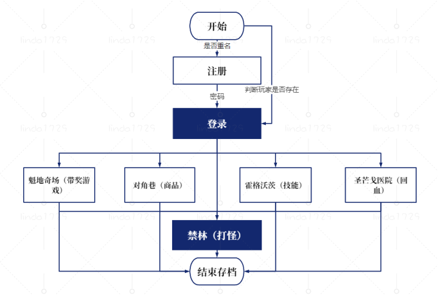 | 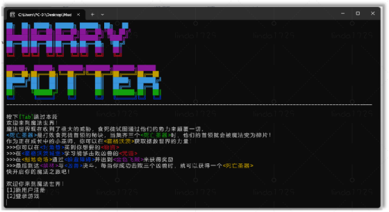 |
| :--------------------------------------------------------: | :------------------------------------------------------: |
|                *图1：游戏整体框架与流程图*                 |         *图2：带有彩色特效的启动界面与背景介绍*          |

| 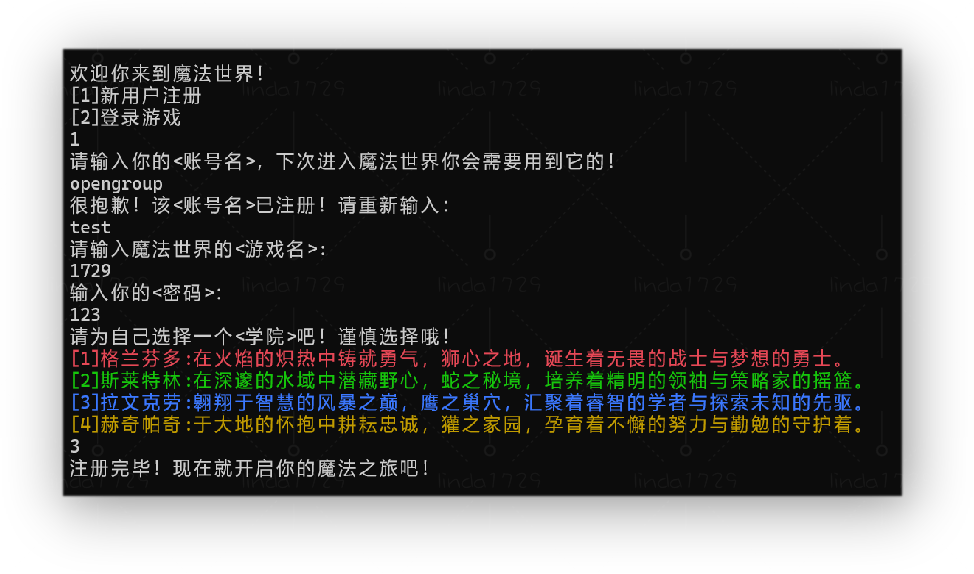 | 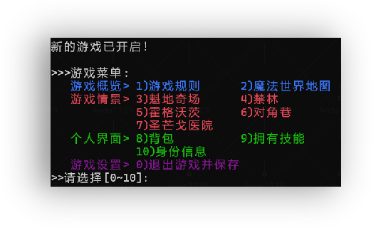 |
| :----------------------------------------------------------: | :----------------------------------------------------: |
|                  *图3：账号注册与分院系统*                   |             *图4：游戏主菜单与读写档功能*              |

| 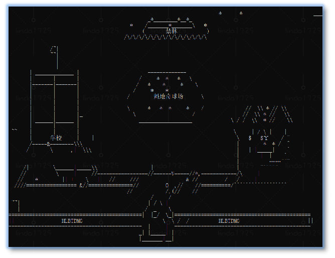 | 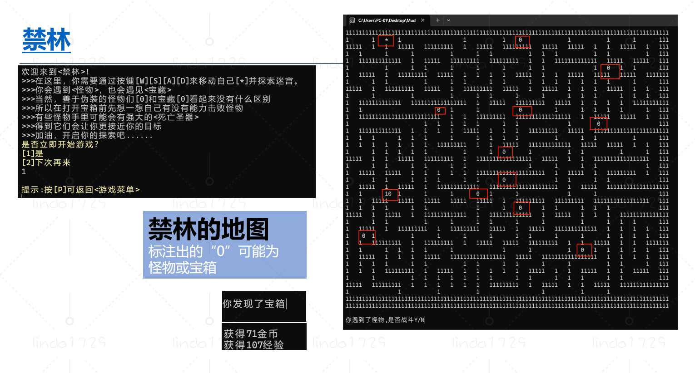 |
| :------------------------------------------------------: | :------------------------------------------------------: |
|             *图5：可视化的魔法世界文字地图*              |             *图6：禁林迷宫探索（WASD移动）*              |

| 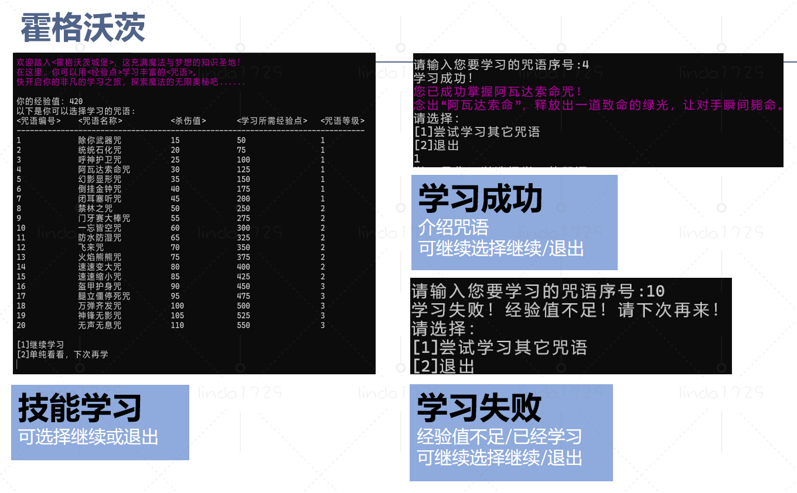 | 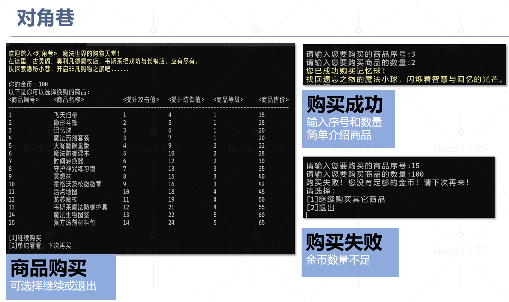 |
| :------------------------------------------------------: | :--------------------------------------------------------: |
|               *图7：霍格沃茨魔咒学习系统*                |                *图8：对角巷物资与装备购买*                 |

| 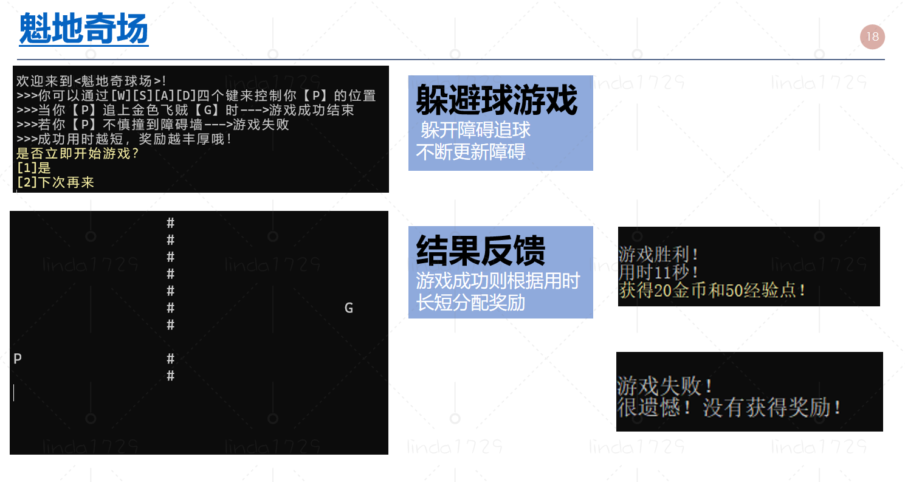 | 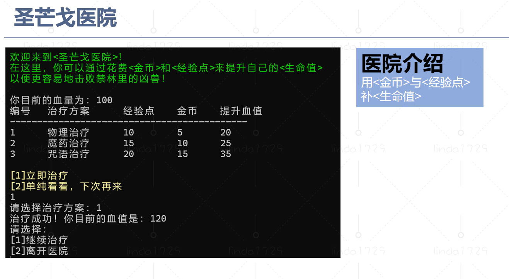 |
| :----------------------------------------------------------: | :---------------------------------------------------------: |
|                 *图9：魁地奇躲避障碍小游戏*                  |                 *图10：圣芒戈医院治疗回血*                  |

| 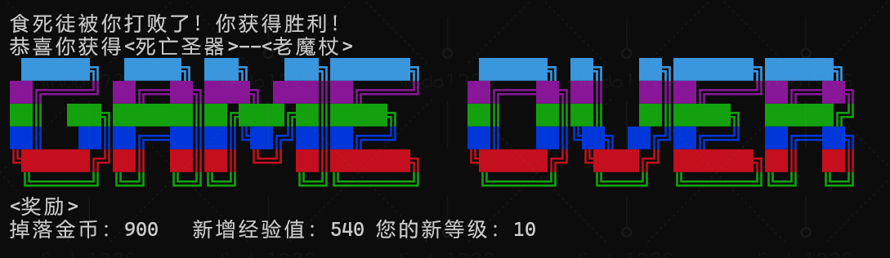 | 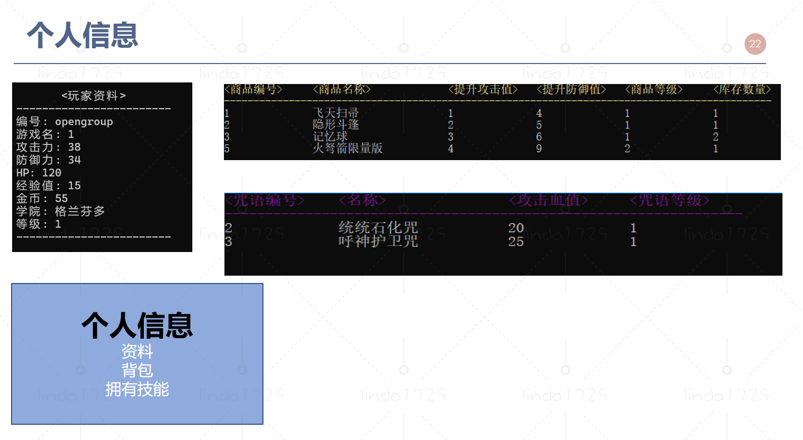 |
| :-------------------------------------------------------: | :-------------------------------------------------------: |
|               *图11：沉浸式回合制战斗系统*                |               *图12：玩家详细面板与物品栏*                |

## 📂 目录结构
- `src/`：全部 C++ 源码与头文件
- `data/`：游戏地图、文案、素材等数据文件（玩家存档 `players.dat` 会在运行时自动生成，不随仓库分发）
- `docs/`：项目截图与文档
- `bin/`：编译输出目录，仓库已清空，仅供构建使用

## 🏗️ 架构设计与类图

项目采用高内聚、低耦合的面向对象设计思想：
*   **MudGame (中控类)**：负责菜单调度与游戏初始化。
*   **MudBase (抽象类)**：作为 Item, Skill, Amap, Player, Monster 的基类，统一封装文件读写及空间分配释放接口。
*   将 **Map(迷宫类)** 与 **Field(球场类)** 的逻辑剥离，专注于玩家位置移动；具体的战斗由 **Fight(战斗类)** 独立接管。

<p align="center">
  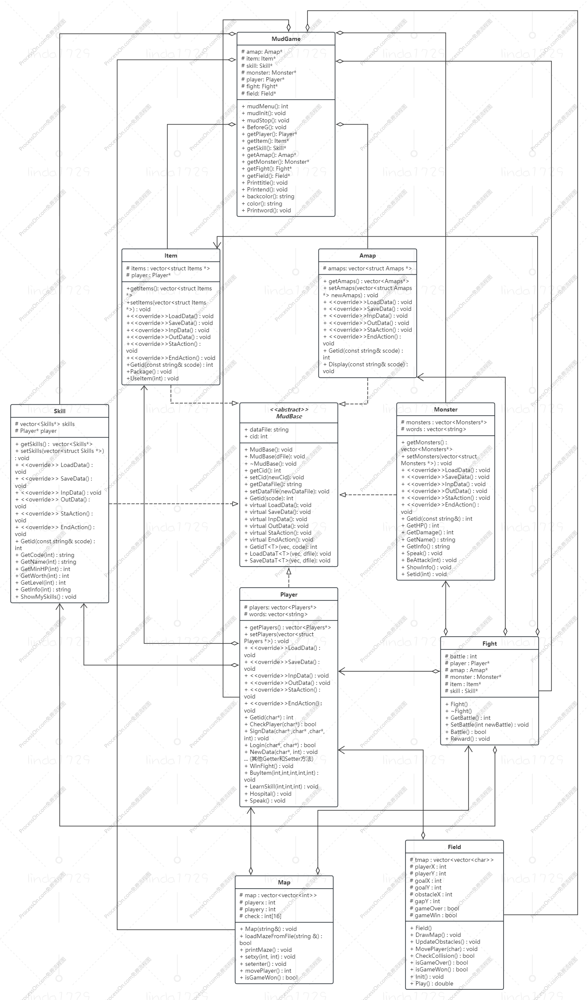
</p>
<p align="center"><i>图13：项目 UML 类图</i></p>

## 🚀 编译与运行指南

1. **环境要求**：支持 C++11 或更高版本的编译器（如 GCC, Clang, MSVC），推荐使用 CodeBlocks 或 VS Code。
2. **克隆项目**：
   
   ```bash
   git clone https://github.com/YourUsername/LumosMUD.git
   cd LumosMUD
   ```

3. **编译运行**（以 g++ 为例）：
   
   ```bash
   g++ -std=c++11 src/*.cpp -I src -o bin/LumosMUD
   ./bin/LumosMUD
   ```
   - Windows 环境可使用 MinGW / MSVC 或直接打开 `MudGame.cbp`（Code::Blocks 工程）编译。
   - 运行时会在 `data/` 下自动创建/更新玩家存档文件，无需手动准备。

## 📄 开源协议
本项目采用 [MIT License](LICENSE) 开源协议。
